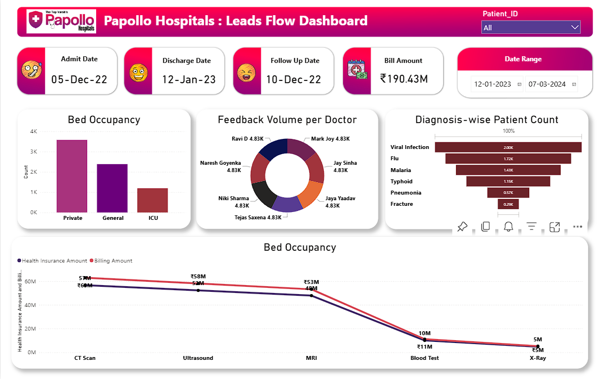

# 🏥 Papollo Hospitals: Leads Flow Dashboard

> Built an interactive Power BI dashboard on hospital patient data to track patient flow, billing vs. insurance gaps, bed occupancy, and doctor feedback—everything in one view.

---

## 📌 Overview

This project analyzes real-world hospital patient records from Papollo Hospitals. The goal was to replace scattered spreadsheets with a single, filterable Power BI dashboard that gives hospital administrators instant visibility into operations. The dashboard covers everything from admission to discharge, across billing, diagnostics, and ward utilization.

---

## ❗ Problem Statement

Hospital staff tracked billing, bed occupancy, and doctor feedback in separate Excel sheets with no unified view. Decision-makers had no fast way to identify overburdened wards, insurance gaps, or diagnosis trends. This project solves that with a live, drill-down dashboard filterable by Patient ID and Date Range.

---

## 📂 Dataset

| Detail | Info |
|---|---|
| Source | Papollo Healthcare Dataset (Excel) |
| Records | ~7,000+ patient entries |
| Columns | 11 |

| Column | Description |
|---|---|
| Patient_ID | Unique patient identifier |
| Admit_Date | Date of admission |
| Discharge_Date | Date of discharge |
| Diagnosis | Medical condition (Viral Infection, Flu, Malaria, Typhoid, Pneumonia, Fracture) |
| Bed_Occupancy | Ward type (Private, General, ICU) |
| Test | Diagnostic test (MRI, CT Scan, Ultrasound, Blood Test, X-Ray) |
| Doctor | Assigned doctor |
| Followup_Date | Follow-up appointment date |
| Feedback | Patient rating (1–5) |
| Billing_Amount | Total bill in INR |
| Health_Insurance_Amount | Insurance covered in INR |

---

## 🛠️ Tools and Technologies

| Tool | Purpose |
|---|---|
| **Microsoft Excel** | Raw data storage, removed duplicates, handled blank rows |
| **Power BI Desktop** | Dashboard design, visuals, slicers, and interactivity |
| **Power Query** | Data transformation: removed duplicates, filled null values with 0, standardized date formats |

---

## ⚙️ Methods

1. **Excel Cleaning** – Removed duplicate rows and corrected inconsistent entries in the source file
2. **Power Query** – Applied remove duplicates, filled null values with 0, and fixed date column formats
3. **Data Modeling** – Single-table flat model loaded into Power BI
4. **Visualization** – Built 6 visuals directly mapped to 6 stakeholder requirements (from Miro planning board)
5. **Interactivity** – Added Patient_ID slicer and Date Range filter for drill-down capability

---

## 💡 Key Insights

- 🦠 **Viral Infection** is the top diagnosis at 2.00K patients; Flu (1.72K) and Malaria (1.43K) follow
- 🛏️ **Private ward** is the most occupied (3K+), nearly 1.5x General and 3x ICU. Signals capacity pressure.
- 💰 **CT Scan** has the largest billing-insurance gap (Billing ~60M vs Insurance ~57M); Blood Test and X-Ray show the smallest gap
- 👨‍⚕️ All 7 doctors each hold 4.83K feedback entries — patient load is evenly distributed
- 📈 **Total billing** across the tracked period reached INR 190.43M
- 🔬 MRI sits mid-range at ~53M while X-Ray and Blood Test are the lowest-cost procedures

---

## 📸 Dashboard Preview

**6 visuals built to match the project requirements:**

| # | Visual | What it shows |
|---|---|---|
| 1 | Patient Info Card | Admit Date, Discharge Date, Follow-Up Date, Bill Amount per Patient |
| 2 | Bed Occupancy Bar Chart | Patient count across Private, General, ICU |
| 3 | Feedback Donut Chart | Feedback volume split per doctor |
| 4 | Diagnosis-wise Bar Chart | Top 6 diagnoses by patient count |
| 5 | Billing vs Insurance Line Chart | Amount comparison across 5 test types |
| 6 | Date Range + Patient_ID Filter | Drill down to any patient or time window |



---

## ▶️ How to Run This Project

1. Clone this repository
   ```bash
   git clone https://github.com/your-username/papollo-hospitals-dashboard.git
   ```
2. Open `Papollo-Healthcare-Dataset.xlsx` to review the raw data
3. Open the `.pbix` file in **Power BI Desktop**
4. If the data source path breaks: go to **Transform Data > Data Source Settings** and relink the Excel file
5. Hit **Refresh** to reload all visuals

> **Requirements:** Power BI Desktop (free from Microsoft), Microsoft Excel

---

## ✅ Results and Conclusion

- Private ward is consistently over-occupied; administration can act on this for resource allocation
- CT Scan and Ultrasound carry the highest billing-insurance gap; actionable for finance and insurance renegotiation
- Even doctor feedback volume confirms fair patient assignment across all 7 doctors
- Viral Infection + Flu make up over 45% of total admissions; useful for seasonal planning and stock pre-ordering

---

## 🔮 Future Work

- Add month-over-month admission and revenue trend analysis
- Connect to live data via Power BI Service + Excel Online for real-time refresh
- Build a patient readmission risk predictor using Python (scikit-learn)
- Set ward-level occupancy alerts when a threshold is crossed
- Add doctor-wise average billing to surface high-cost treatment patterns

---

## 👨‍💻 Author and Contact

**Gulfam Raza**
B.Tech – Information Technology, RKGIT Ghaziabad

🎓 CGPA: **8.02** | **First Division with Distinction**

Specialization: Data Analytics & its related roles.

| | |
|---|---|
| 📧 Email | razagulfam0786@gmail.com |
| 📱 Mobile | +91-6395528887 |
| 💼 LinkedIn | [linkedin.com/in/your-profile](https://www.linkedin.com/in/gulfamraza1) |

---

⭐ If this project helped you, give it a star on GitHub!
